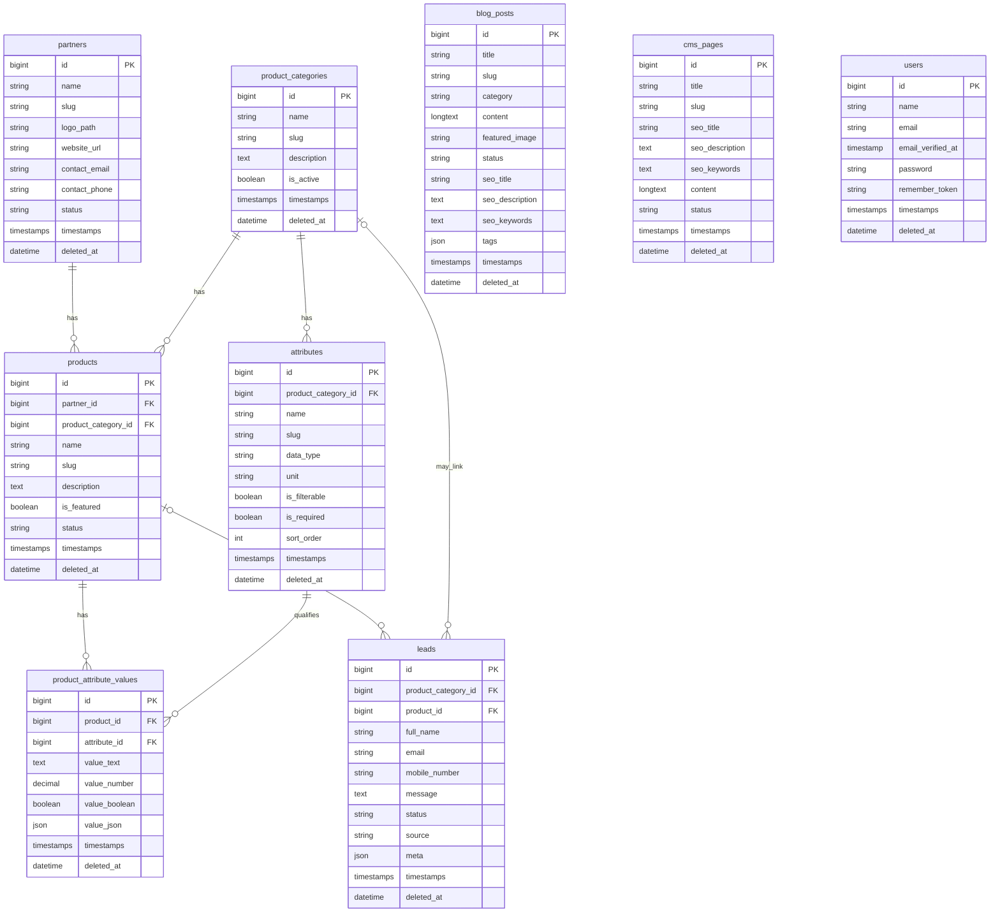

Entity Relationship Diagram

```mermaid
erDiagram
  partners ||--o{ products : has
  product_categories ||--o{ attributes : has
  product_categories ||--o{ products : has
  products ||--o{ product_attribute_values : has
  attributes ||--o{ product_attribute_values : qualifies
  products o|--o{ leads : may_link
  product_categories o|--o{ leads : may_link

  partners {
    bigint id PK
    string name
    string slug
    string logo_path
    string website_url
    string contact_email
    string contact_phone
    string status
    timestamps timestamps
    datetime deleted_at
  }

  product_categories {
    bigint id PK
    string name
    string slug
    text description
    boolean is_active
    timestamps timestamps
    datetime deleted_at
  }

  attributes {
    bigint id PK
    bigint product_category_id FK
    string name
    string slug
    string data_type
    string unit
    boolean is_filterable
    boolean is_required
    int sort_order
    timestamps timestamps
    datetime deleted_at
  }

  products {
    bigint id PK
    bigint partner_id FK
    bigint product_category_id FK
    string name
    string slug
    text description
    boolean is_featured
    string status
    timestamps timestamps
    datetime deleted_at
  }

  product_attribute_values {
    bigint id PK
    bigint product_id FK
    bigint attribute_id FK
    text value_text
    decimal value_number
    boolean value_boolean
    json value_json
    timestamps timestamps
    datetime deleted_at
  }

  leads {
    bigint id PK
    bigint product_category_id FK
    bigint product_id FK
    string full_name
    string email
    string mobile_number
    text message
    string status
    string source
    json meta
    timestamps timestamps
    datetime deleted_at
  }

  blog_posts {
    bigint id PK
    string title
    string slug
    string category
    longtext content
    string featured_image
    string status
    string seo_title
    text seo_description
    text seo_keywords
    json tags
    timestamps timestamps
    datetime deleted_at
  }

  cms_pages {
    bigint id PK
    string title
    string slug
    string seo_title
    text seo_description
    text seo_keywords
    longtext content
    string status
    timestamps timestamps
    datetime deleted_at
  }

  users {
    bigint id PK
    string name
    string email
    timestamp email_verified_at
    string password
    string remember_token
    timestamps timestamps
    datetime deleted_at
  }
```

